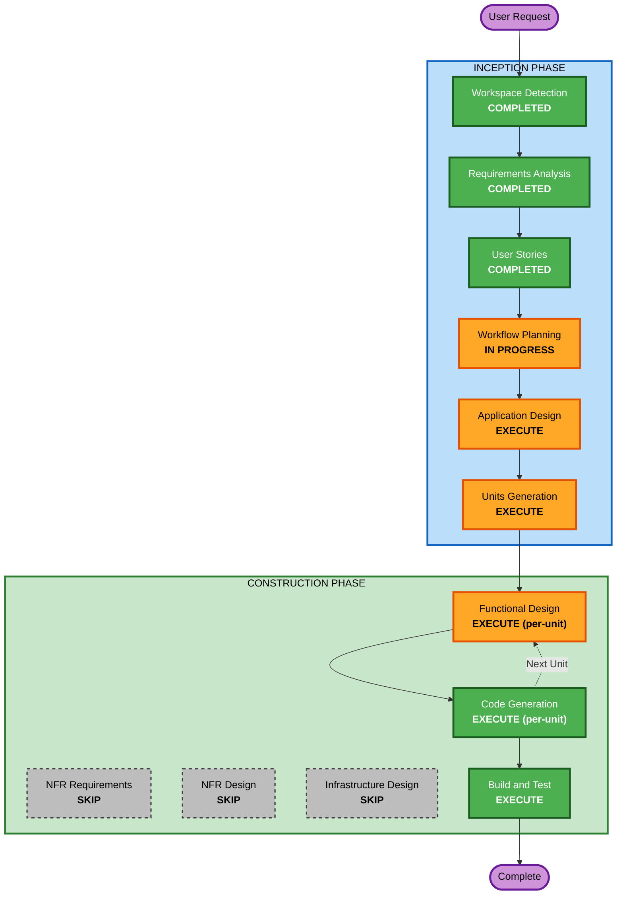

# Execution Plan - 테이블오더 서비스

## 1. 프로젝트 개요

| 항목 | 값 |
|------|-----|
| **프로젝트 유형** | Greenfield (신규) |
| **복잡도** | Complex |
| **범위** | System-wide (Frontend + Backend + Database) |
| **사용자 유형** | 2 (고객, 관리자) |
| **스토리 수** | 12 (고객 5, 관리자 7) |
| **기술 스택** | React TypeScript + Java Spring Boot + MySQL |
| **배포** | AWS (EC2, RDS) |
| **보안 확장** | 미적용 |

---

## 2. 범위 및 영향 분석

### 2.1 변경 영향 평가

| 영향 차원 | 평가 | 설명 |
|-----------|------|------|
| 사용자 대면 변경 | **High** | 전체 UI 신규 구축 (고객용 + 관리자용) |
| 구조적 변경 | **High** | 완전히 새로운 프로젝트 구조 |
| 데이터 모델 변경 | **High** | 8개 엔티티 신규 설계 |
| API 변경 | **High** | 전체 REST API + SSE 엔드포인트 신규 |
| NFR 영향 | **Low** | 소규모, 단순한 성능 요건 |

### 2.2 리스크 평가

| 리스크 항목 | 수준 | 설명 |
|-------------|------|------|
| 전체 리스크 | **Low-Medium** | Greenfield, 롤백 용이 |
| SSE 구현 복잡도 | **Medium** | EventSource 헤더 제한, 재연결 처리 필요 |
| 세션 라이프사이클 | **Medium** | 엣지 케이스 존재 (동시 주문/이용완료) |
| 테스트 복잡도 | **Medium** | 프론트-백엔드 통합, SSE 실시간 테스트 |

---

## 3. 단계별 실행 결정

### Workflow Visualization



### Text Alternative

```
INCEPTION PHASE:
  [COMPLETED] Workspace Detection
  [COMPLETED] Requirements Analysis
  [COMPLETED] User Stories
  [IN PROGRESS] Workflow Planning
  [EXECUTE] Application Design
  [EXECUTE] Units Generation

CONSTRUCTION PHASE (per-unit):
  [EXECUTE] Functional Design
  [SKIP] NFR Requirements
  [SKIP] NFR Design
  [SKIP] Infrastructure Design
  [EXECUTE] Code Generation
  [EXECUTE] Build and Test
```

---

## 4. 단계별 상세 결정 및 근거

### INCEPTION PHASE

| 단계 | 결정 | 깊이 | 근거 |
|------|------|------|------|
| Workspace Detection | **COMPLETED** | - | Greenfield 확인 |
| Reverse Engineering | **SKIP** | - | Greenfield - 기존 코드 없음 |
| Requirements Analysis | **COMPLETED** | Standard | 상세 요구사항 제공, 11개 기술 결정 확정 |
| User Stories | **COMPLETED** | Standard | 12개 스토리, 2개 페르소나, 2개 Journey |
| Workflow Planning | **IN PROGRESS** | Standard | 실행 계획 생성 중 |
| Application Design | **EXECUTE** | Standard | 완전히 새로운 컴포넌트/서비스/데이터 모델 필요 |
| Units Generation | **EXECUTE** | Standard | Frontend/Backend 분리, 3개 유닛 분해 필요 |

### CONSTRUCTION PHASE

| 단계 | 결정 | 깊이 | 근거 |
|------|------|------|------|
| Functional Design | **EXECUTE** | Standard | 세션 라이프사이클, 주문 상태머신, SSE 이벤트, JWT 인증 등 복잡한 비즈니스 로직 |
| NFR Requirements | **SKIP** | - | 기술 스택 이미 확정(React/Spring Boot/MySQL), 소규모(1~10 테이블), 보안 확장 미적용, 성능 요건 단순(SSE 2초) |
| NFR Design | **SKIP** | - | NFR Requirements 미실행으로 자동 SKIP |
| Infrastructure Design | **SKIP** | - | AWS 구성 단순(EC2 1대 + RDS 1대), 코드 생성 시 설정 파일에서 충분 |
| Code Generation | **EXECUTE** | Standard | 핵심 산출물 - 전체 애플리케이션 코드 |
| Build and Test | **EXECUTE** | Standard | 빌드/테스트 지침 및 실행 |

---

## 5. 유닛 분해 계획

### 3개 유닛 구성

| 유닛 | 범위 | 의존성 |
|------|------|--------|
| **Unit 1: Backend Core** | Spring Boot 전체 (엔티티, 리포지토리, 서비스, 컨트롤러, JWT, SSE, 시드데이터) | 없음 (최우선 구축) |
| **Unit 2: Frontend Customer** | 고객 페이지 (메뉴, 장바구니, 주문, 내역, 자동로그인) | Unit 1 (API 계약) |
| **Unit 3: Frontend Admin** | 관리자 페이지 (로그인, 대시보드, 모니터링, 테이블관리, 메뉴관리) | Unit 1 (API 계약) |

### 실행 순서
```
Unit 1 (Backend Core) --> Unit 2 (Frontend Customer) --> Unit 3 (Frontend Admin) --> Build & Test
```

### 유닛별 Construction 흐름
```
각 유닛:
  Functional Design --> Code Generation (Part1: Plan --> Part2: Generate)
```

---

## 6. 성공 기준

- 고객이 태블릿에서 메뉴 조회 → 장바구니 → 주문 생성을 완료할 수 있다
- 관리자가 실시간으로 주문을 모니터링하고 상태를 변경할 수 있다
- SSE를 통해 2초 이내에 신규 주문이 대시보드에 표시된다
- 테이블 세션 라이프사이클(시작 → 이용완료)이 정상 동작한다
- 모든 유닛 테스트가 통과한다
- 시드 데이터가 정상 로드된다

---

## 7. Extension Compliance

| Extension | Enabled | Status |
|-----------|---------|--------|
| Security Baseline | No | Opted out during Requirements Analysis (Q11: B) - SKIP |
